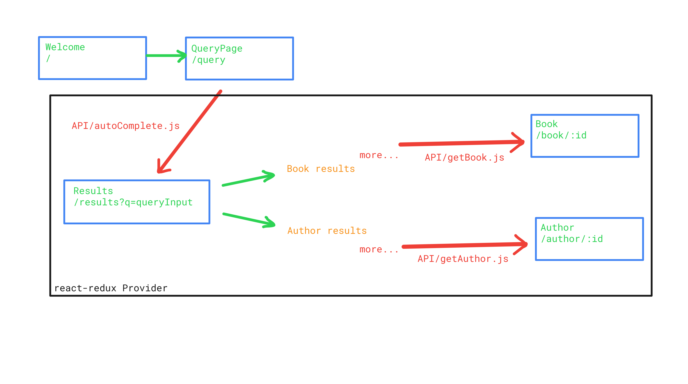

# Book Catalogue

> Description of the project:  "Catalogue of Statistics"

> This project aims to use of Goodreads API services. You can type in a book or author name and get information about the source that you are looking for.

> Routes are used to make an easier navigation in the SPA(Single Page Application). As seen in the image above, the state is preserved after the main query has been fired.

> Coming back from book details or from author details to the results page is not firing a new request to the API provider.

> Every time one of the following page renders: Results, Book, or Author, the application logic first checks the current state. If the desired object is there, then it immediately renders the data in the page. If it is not there then it sends the API request and waits for an answer.

> When the response received, it dispatches the necessary actions to rewrite application state.

> The API requests are held in the `useEffect` methods. They are hooked by the related objects such as `bookId`, `authorId`, and `query` word. Thus, any change on these object will begin the process.

## Screenshots

  
  

## Built With

- React
- Redux
- JavaScript
- SASS
- create-react-app

## Live Demo

[Live Demo Link](https://kc-book-catalogue.herokuapp.com/)

## Getting Started

To get a local copy up and running follow these simple example steps.

### Prerequisites

- Browser
- Text editor
- Node.js

### Setup

- In the directory where you want to install the project, please open the terminal and run:
- `git clone https://github.com/kubilaycaglayan/book-catalogue.git`
- And then: `cd book-catalogue`

### Install

- After cloning, in the project directory, please run
- `npm install`

### Usage

- After installint with `npm install`, you can run:
- `npm start` => this should open up a browser page in your computer.

### Run tests

- After installing the project, you can run tests with this simple command:
- `npm test`
- And please push button `a` to re-run all the tests that were committed before.

## Authors

👤 **Kubilay Caglayan**

- Website: [kubilay](https://kubilaycaglayan.com)
- Github: [@kubilaycaglayan](https://github.com/kubilaycaglayan)
- Twitter: [@kbcaglayan](https://twitter.com/kbcaglayan)
- Linkedin: [linkedin](https://linkedin.com/in/kubilaycaglayan)

## 🤝 Contributing

Contributions, issues, and feature requests are welcome!

Feel free to check the [issues page](https://github.com/kubilaycaglayan/book-catalogue/issues).

## Show your support

Give a ⭐️ if you like this project!

## Acknowledgments

- https://www.goodreads.com/api
- https://testing-library.com/
- https://github.com/kubilaycaglayan/react-template
- https://reactrouter.com/web/guides/quick-start

## 📝 License

This project is MIT licensed.